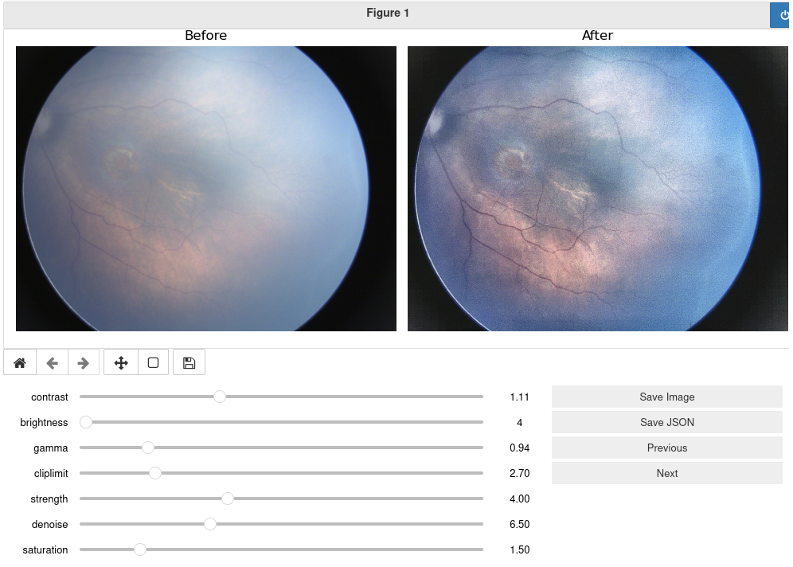

# Jupyter Image Editor
# What is it?
Basic batch image editor built in Jupyter with its native sliders
## Why?
### General Purpose
* Quickly generate a large sum of enhanced images
* JSON is also generated with the values chosen in the sliders, suitable for AI model training
### Original Purpose
This tool was used to generate better looking images of retinal images in infants. It has been demonstrated that this procedure significantly increases the visibility of poor quality retinal images.
## Features
* Live preview of changes on the image
* Easy and ready to use Jupyter Notebook
* Easily modifiable for new changes on the image
* Batch edit
* JSON and JPG output
# Usage
1. Clone this directory and run Jupyter
   ```bash
   git clone https://github.com/monajemi-arman/jupyter_image_editor
   jupyter-notebook jupyter_image_editor.ipynb
   ```
2. Run each cell until you reach the one starting with the following:
   ```python
   # Run this block for every new folder
   
   image_dir = 'images'
   ```
4. Change `image_dir` to the directory path your images are located in
5. Use the sliders to change the image as you wish
6. Click on Save Image (no need to click on Save JSON after each image)
7. When you have finished editing all the images in the directory, click on Save JSON.

* The JSON contains the values of the sliders.
---
# Demo

